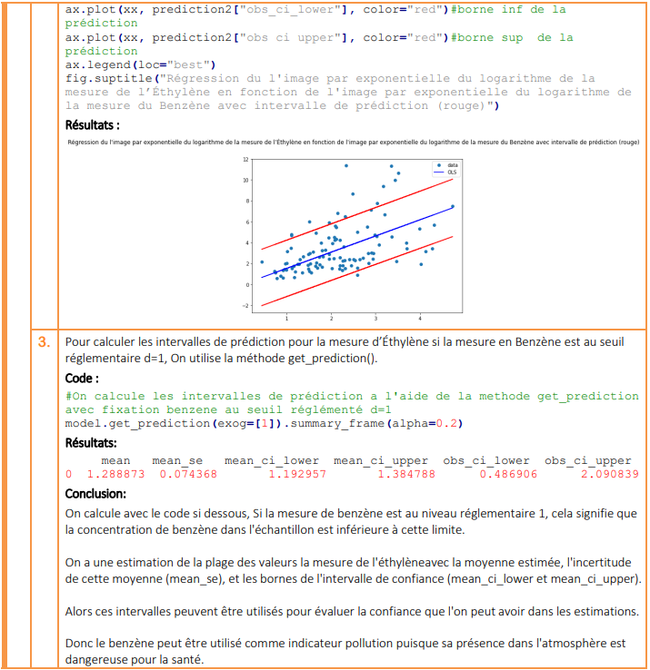

# Probabilités Discrètes et Statistiques Descriptives

## Introduction

Ce projet a été réalisé dans le cadre du TP noté numéro 79899 en Probabilités Discrètes et Statistiques Descriptives à l'Université Lyon 1 pour l'année universitaire 2022-2023.

## Description du Projet

Le projet consiste en l'analyse statistique de données de pollution industrielle dans le sud lyonnais entre 2016 et 2017. Les mesures de différents polluants sont examinées, et des questions statistiques sont résolues à l'aide de Python. Les principales étapes du projet comprennent le chargement des données, le traitement statistique, la simulation, et la réalisation d'une régression linéaire.

## Exécution du Projet

1. Assurez-vous d'avoir Python installé sur votre système.
2. Exécutez le fichier Python `analyse.py` dans un environnement compatible avec les bibliothèques utilisées (numpy, matplotlib, pandas, scipy.stats, statsmodels).
3. Le script effectuera divers calculs statistiques, simulations et une régression linéaire, générant des résultats et des graphiques.
4. Consultez le rapport au format PDF, nommé `rapport.pdf`, pour une présentation détaillée des résultats et des réponses aux questions.

(Cliquez sur l'image ci-dessous pour accéder au rapport complet au format PDF.)

## Bibliothèques Utilisées

- `numpy` pour les calculs numériques
- `matplotlib` pour la création de graphiques
- `pandas` pour la manipulation des données
- `scipy.stats` pour les statistiques
- `statsmodels` pour la réalisation de la régression linéaire

Le code Python est commenté pour assurer une compréhension claire des étapes effectuées.
